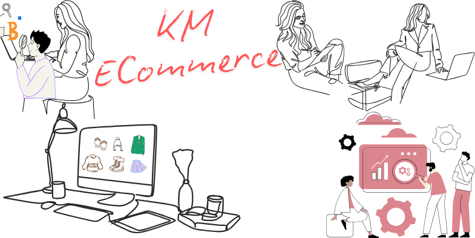

# Introduction

KM is an opensource [laravel eCommerce] framework built on some of the hottest technologies such as [Laravel](https://laravel.com/) (a [PHP](https://secure.php.net/) framework) and [Tailwind CSS](https://tailwindcss.com/) a progressive CSS Library built with the help of [Vite](https://vite.dev/).

KM can help you reduce the time, cost, and workforce that you are going to spend for building online stores or migrating to the fast-paced online world. Either small or huge business can easily benefit. The best part, it's straightforward to set it up!


## Deployment

To deploy this project run

```bash
  composer i


  php artisan migrate 
  
  or direct run sql file in /database/data/bridgemonkcorp.sql
  
  php artisan serve
```

# Getting Started


[Install KM](https://www.youtube.com/watch?v=1J7U5n7h8Lo) with Composer 

Follow the [Getting Started with KM](https://www.youtube.com/watch?v=1J7U5n7h8Lo) Tutorial


Steps

1st step - 
[Click](localhost:8000/admin/setup) on this link to setup ecommerce & Enter store name, description, store email address & phone number. 


2nd step - 
Enter your admin name, email & password to proceed further. Click on next.


3rd step - 
Verify the details that you have set-up for your store that it whether mayches with all the details that you have entered.


4th step - 
Your admin panel has been setup. Click on Go to admin panel to go to admin enter your email & password and redirect to admin panel dashboard.


This is your admin panel dashboard with containing all the essential features that admin panel might needed.


Now go to product tab and add new product name, price, description & excerpt. Click on save.


Now go to product tab and add new product price, compare price & cost per item. Click on save.


Now in product gallery add multiple products images it will take some time to save, so please be patient.


Now go to product tab and add new product inventory stock & weight per item. Click on save. Add your shipping box weight and click on save.


Now you will see how will see how your product page will look, you can check this on by clicking on preview.


This is how your product will look like on admin page on product being listed


Now we are going to create collection by clicking on create new collection and then adding your collection title and description.


NOw we are going to see product collection title and description.


Now select what type of product you want to add for it to being listed. 


Click on browser product to add the product.


Search and add the product that you want to add in your collection.


Now you can add the collection cover image for your collection demo.


Now we are going to add shipping rule. For that click on shipping and click on create new.
Add zone name. 


Select the zone country


Click on add rate.


Add rate name, price & description for shipping rate policy.


After clicking on add condition, we have two option either based on weight and price. You can add any.


Now we are going to create tax zone. Click on create tax zone.


Create tax zone name and select the country for tax zone.


Add tax rate name, tax percentage & tax priority.


Now we are goin to create discount for your products for that we can generate discount code by clicking on generate, we can add type percentage & value, we can add specific product or collection and select the date from which it is going to start.


As we are goin to select the product for discount.


Click on save to save it.


Now we are going to create new account and sign up for it.


We are going to add one of our product to the cart.


After adding to cart we are going to checkout.


We are going to apply discount code and going to add all the required details to get it delivered.


We are to select fixed charge & cash on delivery for it. 


Now we can check in our admin that we have recived the order.


This is the order details that we have received.


# Accelerate Your Online Store Launch with the KM Freemium!

We cover all the basic features of ecommerce that is needed for an online store [KM Starter Pack](https://www.youtube.com/watch?v=1J7U5n7h8Lo), with easy streamlining setup and integration for launch. Find your success through our free product. 


# Commerce For Every Need


With KM, you can easily create use cases for various commerce needs like cloth, garment, textile, and many more.


# License
KM is a truly open-source laravel eCommerce framework that will always be free under the [MIT License](https://opensource.org/license/mit).

# Security Vulnerabilities
If you think that you have found a security issue in Bagisto, please do not use the issue tracker and do not post it publicly. Instead, all security issues must be sent to [mailto:bridgemonkcorp@gmail.com](mailto:bridgemonkcorp@gmail.com).

# Contributors

This project is on [Open Collective](https://opencollective.com/), and it exists thanks to the people who contribute.


# Sponsors

Support this project by becoming a sponsor. Your logo will show up here with a link to your website.

Mail us to show your interest and we would love to serve you.
